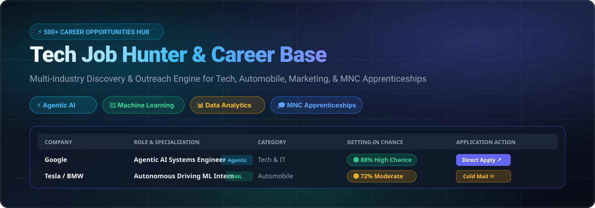
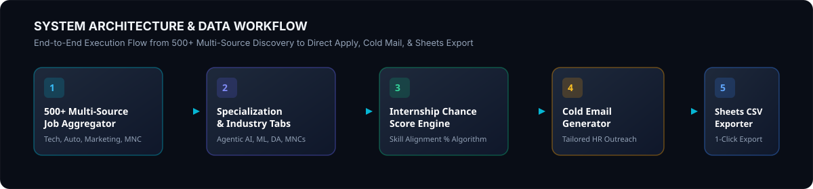

<p align="center">
  
</p>

<p align="center">
  <a href="#-quick-start"></a>
  <a href="#-quick-start"></a>
  <a href="#-quick-start"></a>
  <a href="#-quick-start"></a>
  <a href="#-quick-start"></a>
</p>

---

## ⚡ Overview

**Tech Job Hunter & Career Base** is an interactive, high-density Job Search Base and Aggregator tracking **500+ tech and IT opportunities** across **Tech & IT**, **Automobile & Mobility** (Tesla, BMW, Mercedes-Benz, Ford, Bosch), **Marketing & AdTech** (Adobe, Ogilvy, HubSpot, WPP), **MNC Apprenticeships** (Google STEP, Microsoft LEAP, IBM, Amazon), and **FinTech & Banking** (Stripe, Goldman Sachs, Bloomberg, Revolut).

Designed specifically for candidates with **Internship & Early-Career Experience**, it features dynamic **Getting-In Chance (%)** evaluation, glowing role highlights for ⚡ **Agentic AI**, 🤖 **Machine Learning**, 📊 **Data Analytics**, 1-click **HR Cold Email generation**, and seamless **Google Sheets CSV export**.

---

## ✨ Key Highlights

### 1. 🤖 Specialized Role Badges & Filters
- ⚡ **Agentic AI**: Glowing Cyan/Violet tags highlighting Multi-agent engineering, LLM orchestration, and Tool-use AI roles.
- 🤖 **Machine Learning (ML)**: Glowing Emerald tags highlighting Deep Learning, PyTorch, Computer Vision, and AI research roles.
- 📊 **Data Analytics (DA)**: Glowing Amber tags highlighting SQL, Product Analytics, Data Pipelines, and Business Intelligence roles.
- 🎓 **MNC Apprenticeships**: Glowing Blue tags for official corporate early-career programs (Google STEP, Microsoft LEAP, IBM, BMW, Bosch).

### 2. 🟢 Dynamic Getting-In Chance Engine
- Calibrated specifically for candidates with **Internship Backgrounds**.
- Recalculates match probabilities live (🟢 **High Chance >75%**, 🟡 **Moderate 55%-74%**, 🔴 **Reach <54%**) as core skills (Python, PyTorch / AI Agents, SQL & Analytics, React, Cloud) are toggled in the Candidate Profile evaluator.

### 3. ✉️ HR Cold Email Generator
- Slide-out modal drawer providing ready-to-send email subject lines and body copy tailored for candidates with internship experience.
- 1-Click "Copy Email Text" and "Launch Mail Client (`mailto:`)" triggers.

### 4. 📊 Google Sheets CSV Exporter
- 1-Click export formatted to RFC 4180 CSV standard.
- Download complete or filtered listings ready for instant import into Google Sheets (`File > Import > Upload`) or Excel.

---

## 📐 System Architecture & Workflow

<p align="center">
  
</p>

---

## 🚀 Quick Start & Local Setup

### Prerequisites
- **Node.js**: v18.0 or higher
- **npm**: v9.0 or higher

### Installation & Launch

```bash
# 1. Clone the repository
git clone https://github.com/your-username/tech-job-hunter.git
cd tech-job-hunter

# 2. Install dependencies
npm install

# 3. Launch local development server
npm run dev
```

Open your browser to `http://localhost:5173/` to run the application live.

### Production Build

```bash
# Type-check and create production build
npm run build

# Preview production build locally
npm run preview
```

---

## 📁 Repository Structure

```text
tech-job-hunter/
├── assets/
│   └── readme/
│       ├── hero-banner.svg              # SVG Hero Header Banner
│       └── architecture-diagram.svg     # System Data Flow Diagram
├── src/
│   ├── components/
│   │   ├── Header.tsx                   # Top Stats Navigation
│   │   ├── CandidateProfile.tsx         # Skill Evaluator Bar
│   │   ├── HuntControlPanel.tsx         # "HUNT NOW" Trigger & Search
│   │   ├── CategoryTabs.tsx             # Industry & Specialization Chips
│   │   ├── SpreadsheetGrid.tsx          # Excel-Style Interactive Table
│   │   └── ColdMailDrawer.tsx           # Tailored Cold Email Generator
│   ├── data/
│   │   └── jobDataset.ts                # 520+ Structured Opportunity Database
│   ├── types/
│   │   └── job.ts                       # TypeScript Interfaces & Schemas
│   ├── utils/
│   │   ├── chanceCalculator.ts          # Internship Chance Score Algorithm
│   │   └── csvExporter.ts               # Google Sheets CSV Generator
│   ├── App.tsx                          # App Component Assembly
│   └── index.css                        # Cyberpunk/Glassmorphism Design System
├── package.json
└── vite.config.ts
```

---

<p align="center">
  <sub>Built with ❤️ for tech job hunters, interns, and early career engineers.</sub>
</p>
